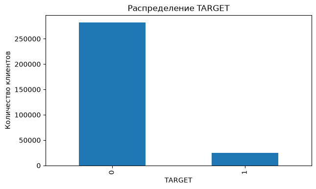
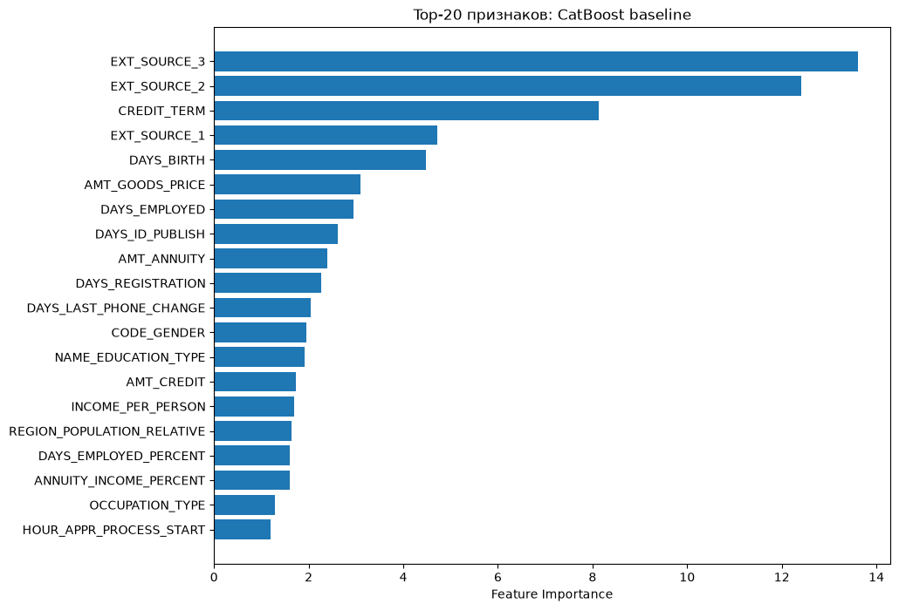
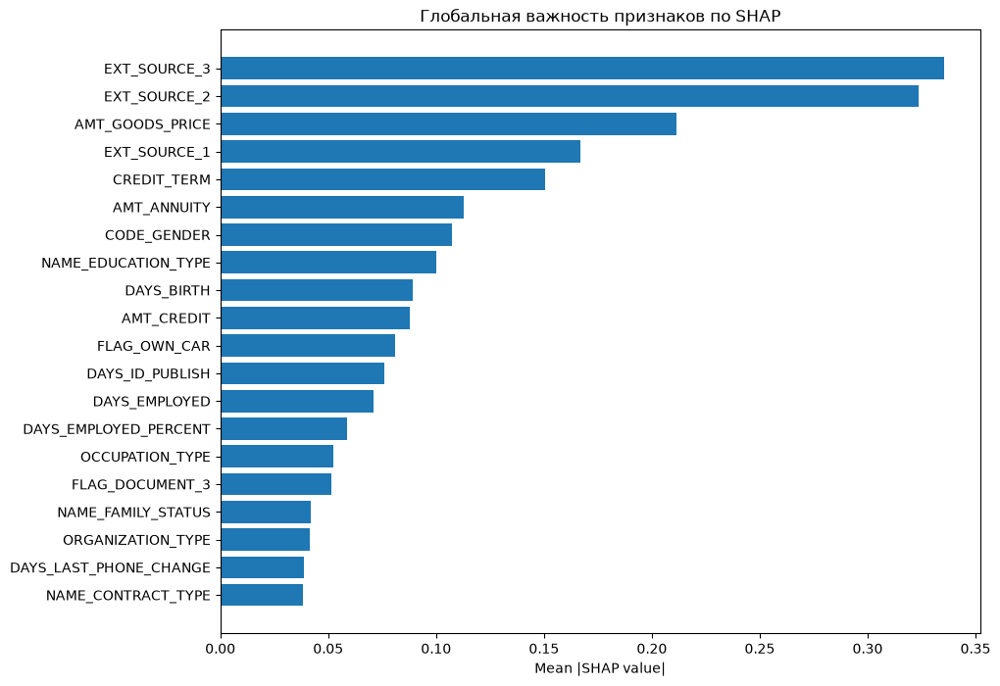

# Home Credit Default Risk кредитный скоринг с CatBoost

Портфолио-проект по машинному обучению для **ранжирования риска кредитного дефолта** на датасете Home Credit Default Risk.

В проекте сравнивается линейная базовая модель с CatBoost, используется стратифицированная кросс-валидация и отдельная отложенная валидационная выборка, исследуются гиперпараметры CatBoost с помощью Optuna, а выбранная модель объясняется с использованием важности признаков и значений SHAP.

> **Лучший ROC AUC на отложенной выборке: 0.76682 — базовый CatBoost**

## Задача

Цель — оценить вероятность того, что у заявителя на кредит возникнут трудности с погашением:

- `TARGET = 0` — нет серьёзных трудностей с погашением;
- `TARGET = 1` — есть трудности с погашением.



Положительный класс составляет всего около **8%** обучающей выборки, поэтому основной метрикой является **ROC AUC**.

## Датасет

В этом проекте используются два файла из Home Credit Kaggle:

- `application_train.csv` — 307,511 строк, 122 столбца;
- `application_test.csv` — 48,744 строк, 121 столбец.

Большие вспомогательные таблицы Home Credit намеренно не используются в этой версии, чтобы проект оставался сосредоточен на понятном пайплайне моделирования с одной таблицей.

## Стратегия валидации

Чтобы снизить риск чрезмерно оптимистичной оценки:

1. 20% размеченных данных один раз выделяются в отложенную валидационную выборку с использованием стратификации.
2. Логистическая регрессия и базовый CatBoost оцениваются на оставшихся данных для разработки с помощью стратифицированной 5-блочной кросс-валидации.
3. Настройка Optuna выполняется только на выборке для разработки, также с использованием 5-блочной кросс-валидации.
4. Модели-кандидаты сравниваются на одной и той же нетронутой отложенной выборке.
5. Только после выбора модели выбранная конфигурация подготавливается к переобучению на всех размеченных данных и отправке результата в Kaggle.

## Пайплайн

```text
EDA + проверки качества данных
        ↓
Очистка данных
        ↓
Конструирование признаков
        ↓
Разделение на development / hold-out
        ↓
Базовая Logistic Regression
        ↓
Базовый CatBoost + 5-fold CV
        ↓
Optuna + 5-fold CV
        ↓
Сравнение моделей на hold-out
        ↓
Важность признаков + SHAP
        ↓
Финальное переобучение + submission
```

## Конструирование признаков

Добавляются пять признаков-отношений, основанных на предметной области:

- `CREDIT_INCOME_PERCENT = AMT_CREDIT / AMT_INCOME_TOTAL`
- `ANNUITY_INCOME_PERCENT = AMT_ANNUITY / AMT_INCOME_TOTAL`
- `CREDIT_TERM = AMT_ANNUITY / AMT_CREDIT`
- `DAYS_EMPLOYED_PERCENT = DAYS_EMPLOYED / DAYS_BIRTH`
- `INCOME_PER_PERSON = AMT_INCOME_TOTAL / CNT_FAM_MEMBERS`

| Признак                  | Пояснение                                                                                                                                                                                                                                                                                    |
| ------------------------ | -------------------------------------------------------------------------------------------------------------------------------------------------------------------------------------------------------------------------------------------------------------------------------------------- |
| `CREDIT_INCOME_PERCENT`  | Отношение суммы кредита к годовому доходу клиента. Показывает, насколько размер кредита велик относительно дохода заемщика. Чем выше значение, тем больше потенциальная долговая нагрузка относительно дохода.                                                                           |
| `ANNUITY_INCOME_PERCENT` | Отношение ежегодного аннуитетного платежа к годовому доходу. Характеризует долю дохода, необходимую для обслуживания кредита. Высокое значение может указывать на повышенную финансовую нагрузку.                                                                                        |
| `CREDIT_TERM`            | Отношение аннуитетного платежа к сумме кредита. Косвенно характеризует условия и продолжительность кредита: при прочих равных меньшая доля платежа относительно суммы кредита обычно соответствует более длительному сроку кредитования.  |
| `DAYS_EMPLOYED_PERCENT`  | Отношение продолжительности трудового стажа к возрасту клиента, когда обе величины представлены в днях. Показывает, какую часть своей жизни клиент находится в текущем трудовом статусе/занятости. Может отражать стабильность занятости.                                                |
| `INCOME_PER_PERSON`      | Доход семьи в расчете на одного члена семьи. Позволяет учитывать не только общий доход, но и количество людей, между которыми фактически распределяются финансовые ресурсы семьи.                                                                                                        |


Специальное значение `DAYS_EMPLOYED = 365243` обрабатывается как аномалия: оно отмечается бинарным признаком, а в исходном столбце заменяется на `NaN`.

## Результаты

| Модель | CV ROC AUC | Hold-out ROC AUC | Accuracy | F1 |
|---|---:|---:|---:|---:|
| Базовый CatBoost | 0.76598 | 0.76682 | 0.91992 | 0.05270 |
| CatBoost + Optuna | 0.76441 | 0.76480 | 0.91997 | 0.04538 |
| Logistic Regression | 0.74696 | 0.74969 | 0.91956 | 0.02484 |

Базовый CatBoost улучшил ROC AUC на отложенной выборке по сравнению с логистической регрессией на +0.0171

### Результат Optuna

В опубликованном запуске используются 3 попытки Optuna, каждая из которых оценивается с помощью 5-блочной кросс-валидации. Небольшое число попыток выбрано для демонстрации процесса подбора гиперпараметров без проведения длительной оптимизации.

В этом запуске Optuna не улучшила выбранную базовую конфигурацию CatBoost.

## Интерпретируемость

Важность признаков CatBoost и встроенные значения SHAP используются как для глобальной, так и для локальной интерпретации.



К наиболее сильным признакам по SHAP относятся `EXT_SOURCE_3`, `EXT_SOURCE_2`, `AMT_GOODS_PRICE`, `EXT_SOURCE_1` и сконструированный признак `CREDIT_TERM`.



Значения SHAP описывают, как модель формирует прогнозы. Наибольшее влияние на прогноз модели оказывают признаки `EXT_SOURCE_3` и `EXT_SOURCE_2`. Далее по значимости идут `AMT_GOODS_PRICE`, `EXT_SOURCE_1` и `CREDIT_TERM`. Остальные признаки оказывают заметно меньшее влияние на итоговый прогноз модели.


## Почему ROC AUC — основная метрика

Accuracy составляет около 0.92 для всех моделей-кандидатов, поскольку датасет сильно несбалансирован. При стандартном пороге классификации 0.5 значение F1 также низкое, потому что сравнительно небольшое число наблюдений получает вероятность выше этого порога.

Для данной бизнес-задачи ROC AUC подходит лучше, поскольку оценивает, насколько хорошо модель ранжирует более рискованных заявителей выше заявителей с меньшим риском, не фиксируя конкретный рабочий порог.

## Структура репозитория

```text
.
├── README.md
├── home-credit-default-risk.ipynb
├── requirements.txt
├── .gitignore
└── data/
    ├── target_distribution.png
    ├── feature_importance.png
    └── shap_global_importance.png

```

## Как запустить

### 1. Клонируйте репозиторий

```bash
git clone https://github.com/Dima-Mendoza/Home-Credit-Default-Risk
cd home-credit-default-risk
```

### 2. Создайте окружение

```bash
python -m venv .venv
```

Активируйте его и установите зависимости:

```bash
pip install -r requirements.txt
```

### 3. Скачайте данные

Скачайте `application_train.csv` и `application_test.csv` из соревнования Kaggle Home Credit Default Risk и поместите их в:

```text
data/
```

### 4. Запустите ноутбук

```bash
jupyter lab
```

Откройте `home-credit-default-risk.ipynb` и выполните ячейки по порядку.

Эксперименты CatBoost в ноутбуке настроены на использование NVIDIA GPU:

```python
"task_type": "GPU"
```

Если обучение с CUDA/GPU недоступно, переключите CatBoost в режим CPU и учитывайте, что время выполнения увеличится.

## Технологический стек

- Python
- pandas / NumPy
- scikit-learn
- CatBoost
- Optuna
- Matplotlib / Seaborn
- встроенные значения SHAP в CatBoost
- Jupyter

## Ограничения и дальнейшие шаги

- Добавить признаки из вспомогательных таблиц Home Credit (bureau, previous_application, история платежей, история кредитных карт и т. д.).
- Увеличить бюджет поиска Optuna и сравнить стабильность настройки при разных seed.
- Оценить калибровку вероятностей, если выход модели используется как реальная вероятность, а не только как оценка для ранжирования.
- Выбрать порог бизнес-решения на основе стоимости ложноположительных и ложноотрицательных ошибок вместо использования значения 0.5 по умолчанию.

## Данные

Датасет: Home Credit Default Risk, соревнование Kaggle.

Страница соревнования: https://www.kaggle.com/competitions/home-credit-default-risk
